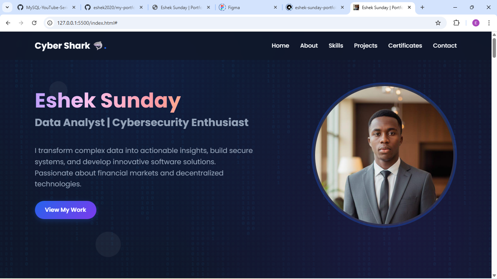
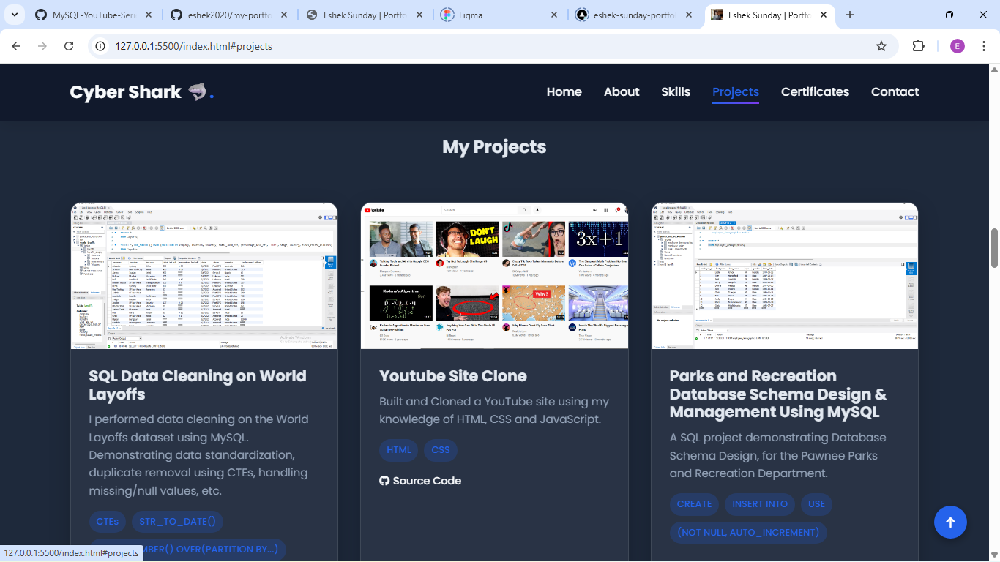

# 🌐 Personal Portfolio Website
**A Modern, Interactive Showcase of Cybersecurity & Data Science Projects**

## 📖 Table of Contents
* [Project Overview](#-project-overview)
* [Design Philosophy](#-design-philosophy)
* [Technical Features](#-technical-features)
* [Technical Stack](#-technical-stack)
* [Data Preview](#%EF%B8%8F-data-preview)
* [File Structure](#-file-structure)
* [Source Code & Access](#-source-code--access)

---

## 📌 Project Overview
This repository contains the source code for my professional portfolio website. The site serves as a central hub for my work, bridging the gap between **Cybersecurity** and **Data Science**. It is designed to provide recruiters and collaborators with an interactive experience while exploring my technical journey and project repositories.

---

## 🎨 Design Philosophy
The website utilizes a **"Cyber-Tech" aesthetic**, characterized by:
* **Glassmorphism:** Using semi-transparent elements with backdrop blurs to create depth.
* **Matrix Background:** A custom JavaScript-powered binary rain effect (0s and 1s) to emphasize a data-driven atmosphere.
* **Dynamic Animations:** A unique 3D flip animation that cycles between a profile photo and a thematic "Cyber Shark" avatar.

---

## 🚀 Technical Features
* **Fully Responsive:** Optimized for desktop, tablet, and mobile devices using CSS Flexbox, Grid, and Media Queries.
* **Smooth Navigation:** Implemented a sticky navigation bar with a "scroll-to-top" functional anchor.
* **Project Gallery:** A categorized showcase of my work (SQL, Python, Excel, Web Dev) with direct links to GitHub source code.
* **Interactive Contact Form:** Integrated with **Formspree** for direct-to-email communication without needing a backend server.
* **Social Integration:** Connected professional profiles including LinkedIn, Twitter, Instagram, and GitHub.

---

## 🏗️ Technical Stack
* **HTML5:** Semantic structure and SEO-friendly metadata.
* **CSS3:** Custom variables (root tokens), keyframe animations, and 3D transforms.
* **JavaScript:** DOM manipulation for the Matrix background effect, scroll-triggered header changes, and mobile menu toggling.
* **External Assets:** FontAwesome icons and Google Fonts (Poppins & Roboto Mono).

---

## 🖼️ Data Preview

### Hero Section & Matrix Effect
*The landing page featuring the high-performance binary animation and the 3D flipping profile card.*

### Projects & Skills Grid
*A clean, categorized layout showcasing technical proficiencies and GitHub repositories.*

---

## 📂 File Structure
* `index.html`: The main page content.
* `style.css`: Custom "Cyber" styling and animations.
* `script.js`: Interactive elements and the Matrix background logic.
* `images`: The folder containing images that were used in the website.

---

## 🔐 Source Code & Access
The source code for this site is maintained in a private repository to protect the integrity and confidentiality of the design and custom logic. I believe in transparency, but also in the security of my development.

If you are a recruiter or a fellow developer interested in reviewing the technical architecture for a professional opportunity, I am happy to grant access upon request.

If you require access to the source code or a deep-dive into the technical architecture, please reach out via the **Contact Section** of the live website:

👉 **[Request Code Access via My Portfolio Contact Page](https://eshek-sunday-portfolio.vercel.app/](https://eshek-sunday-portfolio.vercel.app/)**
